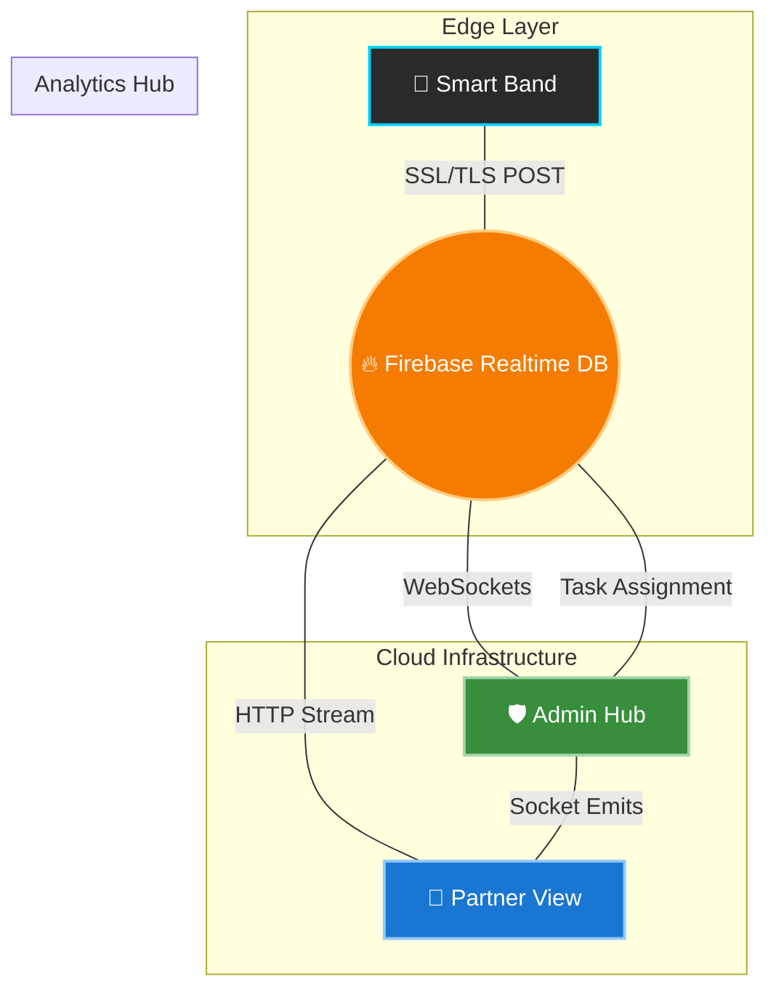

# <p align="center"><b>FestFlow</b></p>


<p align="center">
  <b>The ultimate synergy of IoT Hardware and Real-Time Analytics for next-generation festival safety.</b>
</p>

<p align="center">
  <a href="#-vision--overview"></a>
  <a href="#-technology-stack"></a>
  <a href="#-premium-user-experience-ux"></a>
  <a href="https://github.com/bharathkumar000/festflow/stargazers"></a>
</p>

---

## 📖 Table of Contents
- [📌 Vision & Overview](#-vision--overview)
- [🏗️ System Architecture](#️-system-architecture)
- [🎨 Premium User Experience (UX)](#-premium-user-experience-ux)
- [⚡ Core Features](#-core-features)
- [🛠️ Technology Stack](#️-technology-stack)
- [📂 Project Structure](#-project-structure)
- [🚀 Getting Started](#-getting-started)

---

## 📌 Vision & Overview

**FestFlow** is a high-fidelity crowd-monitoring ecosystem designed for large-scale public gatherings. By integrating physical IoT sensors with a live digital command center, we provide organizers with **360° visibility** into attendee movement, automatic medical distress detection, and streamlined emergency response.

> [!TIP]
> **FestFlow** is optimized for high-density environments where traditional monitoring often fails.

---

## 🏗️ System Architecture

### 🌀 The Data Journey


---

## 🎨 Premium User Experience (UX)

### 1. 🛡️ The Admin Command Center
Built for global situational awareness, the Admin Hub allows organizers to:
*   **📍 Real-time Heatmapping:** Track crowd density across multiple zones.
*   **🚨 Global Alert Grid:** Instant visualization of active medical or manual panic signals.
*   **⚙️ Dynamic Zone Management:** Create or remove zones on the fly.
*   **📊 Live Database View:** Direct link to your Firebase backend for deep inspection.

### 2. 🤝 The Partner Dashboard
A mobile-first interface optimized for ground staff response teams:
*   **⏳ Task Allocation:** Receive automated assignments for the nearest emergency.
*   **🗺️ Integrated GPS Navigation:** Direct deep-link to Google Maps for the exact distressed coordinate.
*   **📱 Responsive Toggle:** Seamlessly switch between desktop monitoring and field-agent view.

---

## ⚡ Core Features

| Feature | Description | Icon |
| :--- | :--- | :---: |
| **Panic Detection** | Automated medical & manual trigger response systems. | 🚨 |
| **Zone Monitoring** | Track attendance and density within custom geographical bounds. | 📍 |
| **Live Sync** | Sub-second data updates powered by Firebase Realtime DB. | 📉 |
| **Mobile Integration** | Field agents receive location-pinned tasks on their devices. | 🛠️ |
| **Glassmorphic UI** | Clean, futuristic dark-mode aesthetics for high-stress environments. | 🌓 |

---

## 🛠️ Technology Stack

<div align="center">

| Component | Technology | Logo |
| :--- | :--- | :---: |
| **Frontend** | HTML5, CSS3, Vanilla JS |  |
| **Styling** | Modern CSS (Glassmorphism) |  |
| **GIS** | [Leaflet.js](https://leafletjs.com/) |  |
| **Backend** | Firebase Realtime DB |  |
| **Hardware** | ESP32-WROOM-32E |  |

</div>

---

## 📂 Project Structure

```bash
festflow/
├── 🌐 website/        # Core Dashboard & Management Hub (HTML, CSS, JS)
│   ├── .env           # Environment configuration (Firebase URL)
│   └── env_example/   # Template folder for secure deployment
├── 🔌 hardware/       # 🚀 [Detailed Hardware Info](./hardware/README.md)
├── 🖼️ assets/         # Project Branding & UX Infographics
└── 📄 README.md       # Project core documentation (You are here)
```

---

## 🚀 Getting Started

### 🛠️ Prerequisites
- [Node.js](https://nodejs.org/) (recommended for local development)
- Modern Browser (Chrome/Edge recommended)
- Firebase Project setup
- ESP32 Development environment

### 🏁 Quick Start: How to Clone and Use

Follow these simple steps to get **FestFlow** running locally:

```bash
# 1. Clone the repository
git clone https://github.com/bharathkumar000/festflow.git

# 2. Enter the project directory
cd festflow

# 3. Install dependencies
npm install

# 4. Configure environment
# Copy the example .env.example values to your website/.env file.
# Make sure to update them with your own Firebase configurations.

# 5. Start the local server
npm start
```

### 🎯 Manual Usage
If you'd like to run it without `npm`:
1.  **Environment Setup:** Copy `.env` details from `website/env_example/` to `website/.env`.
2.  **Launch Hub:** Open [website/fest.html](website/fest.html) in your browser.
3.  **Authentication:**
    *   **Admin Access:** `Username: 1` | `Password: 1`
    *   **Partner Access:** `Username: 2` | `Password: 2`
4.  **Hardware Connection:** See the dedicated **[Hardware README](./hardware/README.md)** for flashing instructions.


---

<p align="center">
  <i>Engineered for safe, smarter festivals.</i><br>
  Built with ❤️ by the FestFlow Team
</p>
